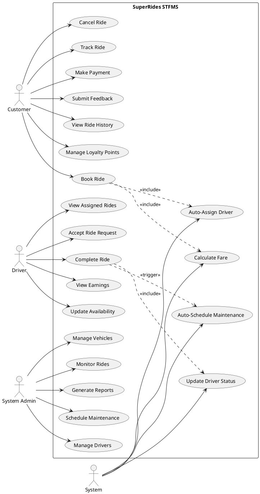

# USE CASE Diagram - SuperRides STFMS

## UML Use Case Diagram Description

### Actors

#### 1. Customer (Primary Actor)
- External user who books rides and uses the service
- Interacts with the system to manage rides and view history

#### 2. Driver (Primary Actor)
- Service provider who accepts and completes rides
- Manages availability and views assigned rides

#### 3. System Administrator (Primary Actor)
- Internal staff who manages the overall system
- Monitors operations, manages users, and generates reports

#### 4. System (Secondary Actor - implicit)
- Automated system actions and scheduled tasks
- Background processes for maintenance and notifications

---

## Use Cases

### Customer Use Cases

#### UC1: Register/Login
**Actor**: Customer  
**Description**: Customer registers for a new account or logs into existing account  
**Precondition**: None for registration; account exists for login  
**Postcondition**: Customer is authenticated and can access system

#### UC2: Book Ride
**Actor**: Customer  
**Description**: Customer requests a new ride by specifying pickup and dropoff locations  
**Precondition**: Customer is logged in  
**Postcondition**: Ride request is created and driver is assigned  
**Includes**: View Available Drivers, Calculate Fare  
**Extends**: Select Vehicle Type, Add Special Instructions

#### UC3: Cancel Ride
**Actor**: Customer  
**Description**: Customer cancels a booked ride  
**Precondition**: Ride exists and is not completed  
**Postcondition**: Ride status updated to 'Cancelled', driver becomes available

#### UC4: Track Ride
**Actor**: Customer  
**Description**: Customer views real-time location and status of ongoing ride  
**Precondition**: Ride is in progress  
**Postcondition**: Customer sees current ride status and location

#### UC5: Make Payment
**Actor**: Customer  
**Description**: Customer completes payment for a ride  
**Precondition**: Ride is completed  
**Postcondition**: Payment is processed and recorded  
**Includes**: Select Payment Method  
**Extends**: Apply Loyalty Points

#### UC6: Submit Feedback
**Actor**: Customer  
**Description**: Customer rates driver and provides comments after ride  
**Precondition**: Ride is completed  
**Postcondition**: Feedback is recorded and driver rating is updated

#### UC7: View Ride History
**Actor**: Customer  
**Description**: Customer views past rides and transaction history  
**Precondition**: Customer is logged in  
**Postcondition**: List of previous rides is displayed

#### UC8: Manage Loyalty Points
**Actor**: Customer  
**Description**: Customer views and redeems loyalty points  
**Precondition**: Customer is logged in  
**Postcondition**: Loyalty points balance is displayed

#### UC9: Update Profile
**Actor**: Customer  
**Description**: Customer updates personal information  
**Precondition**: Customer is logged in  
**Postcondition**: Customer information is updated

---

### Driver Use Cases

#### UC10: Register/Login
**Actor**: Driver  
**Description**: Driver registers or logs into the system  
**Precondition**: Driver has valid license  
**Postcondition**: Driver is authenticated

#### UC11: Update Availability
**Actor**: Driver  
**Description**: Driver sets status (Available/Busy/Offline) and working hours  
**Precondition**: Driver is logged in  
**Postcondition**: Driver availability status is updated

#### UC12: View Assigned Rides
**Actor**: Driver  
**Description**: Driver views ride requests assigned to them  
**Precondition**: Driver is logged in  
**Postcondition**: List of assigned rides is displayed

#### UC13: Accept Ride Request
**Actor**: Driver  
**Description**: Driver accepts an assigned ride request  
**Precondition**: Ride is assigned to driver  
**Postcondition**: Ride status changes to 'Accepted', customer is notified

#### UC14: Start Ride
**Actor**: Driver  
**Description**: Driver starts the ride after picking up customer  
**Precondition**: Ride is accepted and customer is picked up  
**Postcondition**: Ride status changes to 'InProgress'

#### UC15: Complete Ride
**Actor**: Driver  
**Description**: Driver marks ride as completed after dropoff  
**Precondition**: Ride is in progress  
**Postcondition**: Ride status changes to 'Completed', fare is calculated  
**Includes**: Update Vehicle Mileage

#### UC16: View Earnings
**Actor**: Driver  
**Description**: Driver views earnings and ride statistics  
**Precondition**: Driver is logged in  
**Postcondition**: Earnings summary is displayed

#### UC17: View Feedback
**Actor**: Driver  
**Description**: Driver views customer ratings and feedback  
**Precondition**: Driver is logged in  
**Postcondition**: Feedback history is displayed

#### UC18: Report Issue
**Actor**: Driver  
**Description**: Driver reports vehicle or ride-related issues  
**Precondition**: Driver is logged in  
**Postcondition**: Issue is logged for admin review

---

### System Administrator Use Cases

#### UC19: Manage Drivers
**Actor**: System Administrator  
**Description**: Admin adds, updates, or removes driver accounts  
**Precondition**: Admin is logged in  
**Postcondition**: Driver records are modified  
**Includes**: Verify Driver License, Approve Driver Registration

#### UC20: Manage Vehicles
**Actor**: System Administrator  
**Description**: Admin adds, updates, or removes vehicles from fleet  
**Precondition**: Admin is logged in  
**Postcondition**: Vehicle records are modified  
**Includes**: Assign Vehicle to Driver

#### UC21: Monitor Rides
**Actor**: System Administrator  
**Description**: Admin views real-time and historical ride data  
**Precondition**: Admin is logged in  
**Postcondition**: Ride data is displayed

#### UC22: Generate Reports
**Actor**: System Administrator  
**Description**: Admin generates operational and financial reports  
**Precondition**: Admin is logged in  
**Postcondition**: Report is generated and displayed  
**Extends**: Export Report (PDF/Excel), Schedule Automated Report

#### UC23: Manage Customers
**Actor**: System Administrator  
**Description**: Admin views and manages customer accounts  
**Precondition**: Admin is logged in  
**Postcondition**: Customer records are displayed/modified

#### UC24: Schedule Maintenance
**Actor**: System Administrator  
**Description**: Admin schedules vehicle maintenance  
**Precondition**: Admin is logged in  
**Postcondition**: Maintenance record is created  
**Includes**: Check Vehicle Mileage

#### UC25: View Maintenance History
**Actor**: System Administrator  
**Description**: Admin views vehicle maintenance records  
**Precondition**: Admin is logged in  
**Postcondition**: Maintenance history is displayed

#### UC26: Process Payments
**Actor**: System Administrator  
**Description**: Admin manages payment issues and refunds  
**Precondition**: Admin is logged in  
**Postcondition**: Payment status is updated

#### UC27: Manage Feedback
**Actor**: System Administrator  
**Description**: Admin reviews customer feedback and takes action  
**Precondition**: Admin is logged in  
**Postcondition**: Feedback is reviewed and actions are recorded

#### UC28: Assign Driver to Ride
**Actor**: System Administrator  
**Description**: Admin manually assigns driver to ride if automatic assignment fails  
**Precondition**: Unassigned ride exists  
**Postcondition**: Driver is assigned to ride

---

### System (Automated) Use Cases

#### UC29: Auto-Assign Driver
**Actor**: System  
**Description**: System automatically assigns available driver based on location and availability  
**Precondition**: Ride request is created  
**Postcondition**: Best available driver is assigned  
**Triggered by**: UC2 (Book Ride)

#### UC30: Calculate Fare
**Actor**: System  
**Description**: System calculates ride fare based on distance, time, and pricing rules  
**Precondition**: Ride is completed  
**Postcondition**: Fare is calculated and stored  
**Included by**: UC2 (Book Ride), UC15 (Complete Ride)

#### UC31: Update Driver Status
**Actor**: System  
**Description**: System automatically updates driver status based on ride completion  
**Precondition**: Ride status changes  
**Postcondition**: Driver status is updated  
**Triggered by**: UC15 (Complete Ride), UC3 (Cancel Ride)

#### UC32: Auto-Schedule Maintenance
**Actor**: System  
**Description**: System automatically schedules maintenance when vehicle reaches mileage threshold  
**Precondition**: Vehicle mileage exceeds threshold (20,000 km)  
**Postcondition**: Maintenance record is created  
**Triggered by**: UC15 (Complete Ride - when updating mileage)

#### UC33: Send Notifications
**Actor**: System  
**Description**: System sends notifications to customers and drivers  
**Precondition**: Event occurs (ride assigned, ride completed, etc.)  
**Postcondition**: Notification is sent  
**Triggered by**: Multiple use cases

#### UC34: Process Loyalty Points
**Actor**: System  
**Description**: System awards or deducts loyalty points based on transactions  
**Precondition**: Ride is completed or points are redeemed  
**Postcondition**: Customer loyalty points are updated  
**Triggered by**: UC5 (Make Payment)

#### UC35: Notify Loyalty Points Expiry
**Actor**: System  
**Description**: System notifies customers about points expiring within 7 days  
**Precondition**: Loyalty points have expiry date within 7 days  
**Postcondition**: Notification is sent to customer  
**Scheduled**: Daily batch process

#### UC36: Update Driver Rating
**Actor**: System  
**Description**: System recalculates driver's average rating when new feedback is submitted  
**Precondition**: Feedback is submitted  
**Postcondition**: Driver rating is updated  
**Triggered by**: UC6 (Submit Feedback)

---

## Relationships Between Use Cases

### <<include>> Relationships
- **Book Ride** includes **Calculate Fare**
- **Book Ride** includes **View Available Drivers**
- **Make Payment** includes **Select Payment Method**
- **Manage Drivers** includes **Verify Driver License**
- **Manage Drivers** includes **Approve Driver Registration**
- **Schedule Maintenance** includes **Check Vehicle Mileage**
- **Complete Ride** includes **Update Vehicle Mileage**
- **Manage Vehicles** includes **Assign Vehicle to Driver**

### <<extend>> Relationships
- **Select Vehicle Type** extends **Book Ride**
- **Add Special Instructions** extends **Book Ride**
- **Apply Loyalty Points** extends **Make Payment**
- **Export Report** extends **Generate Reports**
- **Schedule Automated Report** extends **Generate Reports**

### Inheritance/Generalization
- **Register/Login** is shared by Customer and Driver (with different implementations)

---

## Use Case Diagram (Text Representation)

```
┌──────────────────────────────────────────────────────────────────┐
│                    SuperRides STFMS                               │
│                                                                    │
│  [Customer]                                                        │
│      |                                                             │
│      |-----(Book Ride)                                             │
│      |         └──<<include>>──(Calculate Fare)                    │
│      |         └──<<include>>──(View Available Drivers)            │
│      |         └──<<extend>>──(Select Vehicle Type)                │
│      |                                                             │
│      |-----(Cancel Ride)                                           │
│      |-----(Track Ride)                                            │
│      |-----(Make Payment)                                          │
│      |         └──<<include>>──(Select Payment Method)             │
│      |         └──<<extend>>──(Apply Loyalty Points)               │
│      |                                                             │
│      |-----(Submit Feedback)                                       │
│      |-----(View Ride History)                                     │
│      |-----(Manage Loyalty Points)                                 │
│      |-----(Update Profile)                                        │
│                                                                    │
│  [Driver]                                                          │
│      |                                                             │
│      |-----(Update Availability)                                   │
│      |-----(View Assigned Rides)                                   │
│      |-----(Accept Ride Request)                                   │
│      |-----(Start Ride)                                            │
│      |-----(Complete Ride)                                         │
│      |         └──<<include>>──(Update Vehicle Mileage)            │
│      |                                                             │
│      |-----(View Earnings)                                         │
│      |-----(View Feedback)                                         │
│      |-----(Report Issue)                                          │
│                                                                    │
│  [System Admin]                                                    │
│      |                                                             │
│      |-----(Manage Drivers)                                        │
│      |         └──<<include>>──(Verify Driver License)             │
│      |                                                             │
│      |-----(Manage Vehicles)                                       │
│      |         └──<<include>>──(Assign Vehicle to Driver)          │
│      |                                                             │
│      |-----(Monitor Rides)                                         │
│      |-----(Generate Reports)                                      │
│      |         └──<<extend>>──(Export Report)                      │
│      |                                                             │
│      |-----(Manage Customers)                                      │
│      |-----(Schedule Maintenance)                                  │
│      |         └──<<include>>──(Check Vehicle Mileage)             │
│      |                                                             │
│      |-----(View Maintenance History)                              │
│      |-----(Process Payments)                                      │
│      |-----(Manage Feedback)                                       │
│      |-----(Assign Driver to Ride)                                 │
│                                                                    │
│  [System] - Automated                                              │
│      |                                                             │
│      |-----(Auto-Assign Driver)                                    │
│      |-----(Update Driver Status)                                  │
│      |-----(Auto-Schedule Maintenance)                             │
│      |-----(Send Notifications)                                    │
│      |-----(Process Loyalty Points)                                │
│      |-----(Notify Loyalty Points Expiry)                          │
│      |-----(Update Driver Rating)                                  │
│                                                                    │
└──────────────────────────────────────────────────────────────────┘
```

---

## Use Case Diagram Creation Tools

The complete UML Use Case diagram can be created using:
1. **Draw.io** (https://draw.io) - Free, web-based
2. **Lucidchart** (https://lucidchart.com) - Professional diagramming
3. **Visual Paradigm** - Full UML support
4. **StarUML** - Open-source UML tool
5. **PlantUML** - Text-based UML generation
6. **Microsoft Visio** - Professional diagramming tool

---

## PlantUML Code (for automated diagram generation)



---

## Notes
- All use cases support the business objectives of SuperRides
- System automation reduces manual intervention and improves efficiency
- Clear separation of concerns between different actor types
- Use cases are designed to be testable and traceable to requirements
