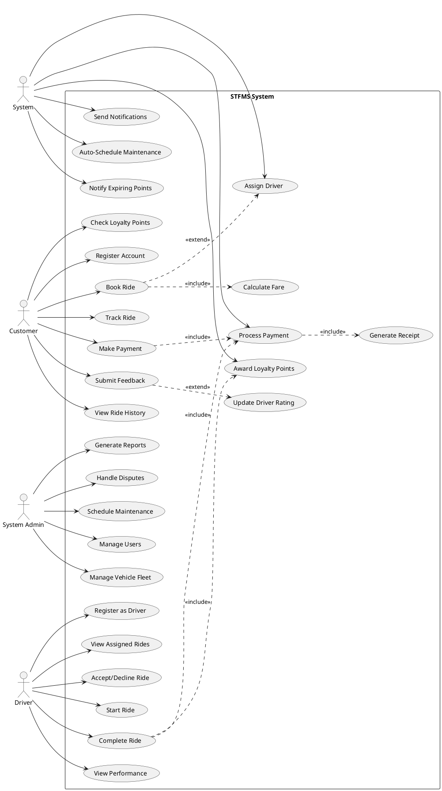

# USE CASE Diagram - Visual Representation
## SuperRides Transportation & Fleet Management System

This file provides a text-based representation of the USE CASE diagram that can be used with diagramming tools like Draw.io, Lucidchart, or PlantUML.

## USE CASE Diagram Structure

```
┌─────────────────────────────────────────────────────────────────────────────────────┐
│                     STFMS USE CASE DIAGRAM                                          │
└─────────────────────────────────────────────────────────────────────────────────────┘

            ┌─────────────────────────────────────────────────────────────┐
            │                   STFMS System Boundary                     │
            │                                                             │
            │                                                             │
Customer    │          ┌──────────────────┐                              │    System
  👤 ────────┼─────────►│ Register Account │                              │      🤖
            │          └──────────────────┘                              │       │
  👤 ────────┼─────────►┌──────────────┐                                 │       │
            │          │  Book Ride   │◄──────────────┐                 │       │
  👤 ────────┼─────────►└──────────────┘               │                 │       │
            │                │                         │                 │       │
            │                │ «include»               │                 │       │
            │                ▼                         │ «extend»        │       │
  👤 ────────┼─────────►┌──────────────┐         ┌────┴──────────┐      │       │
            │          │  Track Ride  │         │ Assign Driver │◄─────┼───────┤
  👤 ────────┼─────────►└──────────────┘         └───────────────┘      │       │
            │                                                            │       │
  👤 ────────┼─────────►┌──────────────┐                                │       │
            │          │ Make Payment │                                 │       │
  👤 ────────┼─────────►└──────────────┘                                │       │
            │                │                                           │       │
            │                │ «include»                                 │       │
            │                ▼                                           │       │
  👤 ────────┼─────────►┌──────────────────────┐                        │       │
            │          │ Process Payment      │◄───────────────────────┼───────┤
  👤 ────────┼─────────►└──────────────────────┘                        │       │
            │                │                                           │       │
  👤 ────────┼─────────►┌────┴──────────┐                               │       │
            │          │ Submit Feedback│                               │       │
  👤 ────────┼─────────►└────────────────┘                              │       │
            │                │                                           │       │
            │                │ «extend»                                  │       │
  👤 ────────┼─────────►┌────▼──────────────┐                           │       │
            │          │ Update Driver Rating│◄──────────────────────────┼───────┤
            │          └────────────────────┘                           │       │
            │                                                            │       │
  👤 ────────┼─────────►┌──────────────────┐                            │       │
            │          │ View Ride History │                            │       │
            │          └──────────────────┘                             │       │
            │                                                            │       │
  👤 ────────┼─────────►┌──────────────────────┐                        │       │
            │          │ Check Loyalty Points │                         │       │
            │          └──────────────────────┘                         │       │
            │                                                            │       │
            │                                                            │       │
   Driver   │          ┌────────────────────┐                           │       │
    👤 ─────┼─────────►│ Register as Driver │                           │       │
            │          └────────────────────┘                           │       │
            │                                                            │       │
    👤 ─────┼─────────►┌──────────────────────┐                         │       │
            │          │ View Assigned Rides  │                         │       │
            │          └──────────────────────┘                         │       │
            │                                                            │       │
    👤 ─────┼─────────►┌──────────────────────┐                         │       │
            │          │ Accept/Decline Ride  │                         │       │
            │          └──────────────────────┘                         │       │
            │                                                            │       │
    👤 ─────┼─────────►┌──────────────────┐                             │       │
            │          │   Start Ride     │                             │       │
            │          └──────────────────┘                             │       │
            │                                                            │       │
    👤 ─────┼─────────►┌──────────────────┐                             │       │
            │          │  Complete Ride   │                             │       │
            │          └────────┬─────────┘                             │       │
            │                   │ «include»                             │       │
            │                   └───────────►┌──────────────────────┐   │       │
            │                                │ Award Loyalty Points │◄──┼───────┤
            │                                └──────────────────────┘   │       │
            │                                                            │       │
    👤 ─────┼─────────►┌──────────────────────┐                         │       │
            │          │  View Performance    │                         │       │
            │          └──────────────────────┘                         │       │
            │                                                            │       │
            │                                                            │       │
System Admin│          ┌──────────────────┐                             │       │
    👤 ─────┼─────────►│  Manage Users    │                             │       │
            │          └──────────────────┘                             │       │
            │                                                            │       │
    👤 ─────┼─────────►┌─────────────────────┐                          │       │
            │          │ Manage Vehicle Fleet│                          │       │
            │          └─────────────────────┘                          │       │
            │                                                            │       │
    👤 ─────┼─────────►┌──────────────────┐                             │       │
            │          │ Generate Reports │                             │       │
            │          └──────────────────┘                             │       │
            │                                                            │       │
    👤 ─────┼─────────►┌──────────────────┐                             │       │
            │          │ Handle Disputes  │                             │       │
            │          └──────────────────┘                             │       │
            │                                                            │       │
    👤 ─────┼─────────►┌─────────────────────┐                          │       │
            │          │ Schedule Maintenance│                          │       │
            │          └─────────────────────┘                          │       │
            │                                                            │       │
            │                                                            │       │
            │          ┌─────────────────────────────┐                  │       │
            │          │ Auto-Schedule Maintenance   │◄─────────────────┼───────┤
            │          └─────────────────────────────┘                  │       │
            │                                                            │       │
            │          ┌─────────────────────────────┐                  │       │
            │          │   Send Notifications        │◄─────────────────┼───────┤
            │          └─────────────────────────────┘                  │       │
            │                                                            │       │
            │          ┌─────────────────────────────┐                  │       │
            │          │ Notify Expiring Points      │◄─────────────────┼───────┤
            │          └─────────────────────────────┘                  │       
            │                                                            │
            └────────────────────────────────────────────────────────────┘

Legend:
  👤      = Actor (stick figure)
  ┌─────┐ = Use Case (oval)
  ───────► = Association
  «include» = Include relationship (dashed arrow)
  «extend»  = Extend relationship (dashed arrow)
  🤖      = System Actor (automated)
```

## Actor Descriptions

### 1. Customer (Primary Actor)
- External user who uses the ride-hailing service
- Initiates most customer-facing use cases

### 2. Driver (Primary Actor)
- Service provider who fulfills ride requests
- Manages their availability and ride completion

### 3. System Administrator (Primary Actor)
- Internal staff who manages system operations
- Has elevated privileges for system management

### 4. System (Secondary Actor)
- Automated system performing background tasks
- Triggers and procedures executing automatically

## Use Case Relationships

### Include Relationships (Mandatory)
```
Book Ride ──«include»──> Calculate Fare
Make Payment ──«include»──> Process Payment Transaction
Process Payment ──«include»──> Generate Receipt
Complete Ride ──«include»──> Process Payment
Complete Ride ──«include»──> Award Loyalty Points
```

### Extend Relationships (Optional)
```
Book Ride ──«extend»──> Assign Driver
Submit Feedback ──«extend»──> Update Driver Rating
Cancel Ride ──«extend»──> Process Refund
```

### Generalization Relationships
```
Register Account
    ├── Register Customer Account
    └── Register Driver Account

View Dashboard
    ├── Customer Dashboard
    ├── Driver Dashboard
    └── Admin Dashboard
```

## PlantUML Format

For automatic diagram generation:



## Draw.io Instructions

1. **Create Actors** (Use stick figures or actor shapes):
   - Place Customer on left side
   - Place Driver on left side below Customer
   - Place System Admin on left side below Driver
   - Place System actor on right side

2. **Create System Boundary** (Rectangle):
   - Draw large rectangle in center
   - Label: "STFMS System"

3. **Create Use Cases** (Ovals):
   - 24 use case ovals inside system boundary
   - Group by actor for clarity

4. **Draw Associations** (Solid lines):
   - Connect actors to their use cases
   - Use straight lines

5. **Draw Include/Extend** (Dashed arrows):
   - Dashed line with «include» or «extend» label
   - Arrow points from including to included use case

6. **Layout Tips**:
   - Customer use cases at top
   - Driver use cases in middle
   - Admin use cases lower middle
   - System use cases on right side
   - Keep related use cases grouped

## Simple Text Format

```
Actors:
- Customer (C)
- Driver (D)
- System Admin (A)
- System (S)

Customer Use Cases:
C → Register Account
C → Book Ride → includes(Calculate Fare) → extends(Assign Driver)
C → Track Ride
C → Make Payment → includes(Process Payment)
C → Submit Feedback → extends(Update Driver Rating)
C → View Ride History
C → Check Loyalty Points

Driver Use Cases:
D → Register as Driver
D → View Assigned Rides
D → Accept/Decline Ride
D → Start Ride
D → Complete Ride → includes(Process Payment, Award Loyalty Points)
D → View Performance

Admin Use Cases:
A → Manage Users
A → Manage Vehicle Fleet
A → Generate Reports
A → Handle Disputes
A → Schedule Maintenance

System Use Cases:
S → Assign Driver
S → Process Payment → includes(Generate Receipt)
S → Send Notifications
S → Award Loyalty Points
S → Auto-Schedule Maintenance
S → Notify Expiring Points
```

## Detailed Use Case Flows

### Primary Use Case: Book Ride

```
┌─────────────────────────────────────────┐
│          UC2: Book Ride                 │
├─────────────────────────────────────────┤
│ Primary Actor: Customer                 │
│ Precondition: Customer logged in        │
│                                         │
│ Main Flow:                              │
│  1. Customer enters pickup location     │
│  2. Customer enters dropoff location    │
│  3. System calculates fare (include)    │
│  4. Customer selects ride type          │
│  5. Customer confirms booking           │
│  6. System creates ride request         │
│  7. System assigns driver (extend)      │
│  8. System sends confirmation           │
│                                         │
│ Postcondition: Ride booked              │
└─────────────────────────────────────────┘
```

### Primary Use Case: Complete Ride

```
┌─────────────────────────────────────────┐
│         UC12: Complete Ride             │
├─────────────────────────────────────────┤
│ Primary Actor: Driver                   │
│ Precondition: Ride in progress          │
│                                         │
│ Main Flow:                              │
│  1. Driver arrives at dropoff location  │
│  2. Driver enters actual distance       │
│  3. System calculates final fare        │
│  4. System marks ride completed         │
│  5. System processes payment (include)  │
│  6. System awards loyalty points (inc)  │
│  7. System updates driver to Available  │
│  8. System sends receipt to customer    │
│                                         │
│ Postcondition: Ride completed           │
└─────────────────────────────────────────┘
```

## Color Coding Recommendations

- **Customer Use Cases**: Light Blue (#E3F2FD)
- **Driver Use Cases**: Light Orange (#FFF3E0)
- **Admin Use Cases**: Light Green (#E8F5E9)
- **System Use Cases**: Light Purple (#F3E5F5)
- **Include/Extend Use Cases**: Light Yellow (#FFFDE7)

## Priority Classification

### High Priority (MVP)
- Register Account
- Book Ride
- Assign Driver
- Complete Ride
- Process Payment
- Submit Feedback

### Medium Priority
- Track Ride
- View Ride History
- Check Loyalty Points
- View Performance
- Generate Reports

### Low Priority
- Handle Disputes
- Manage Users
- Configure Settings
